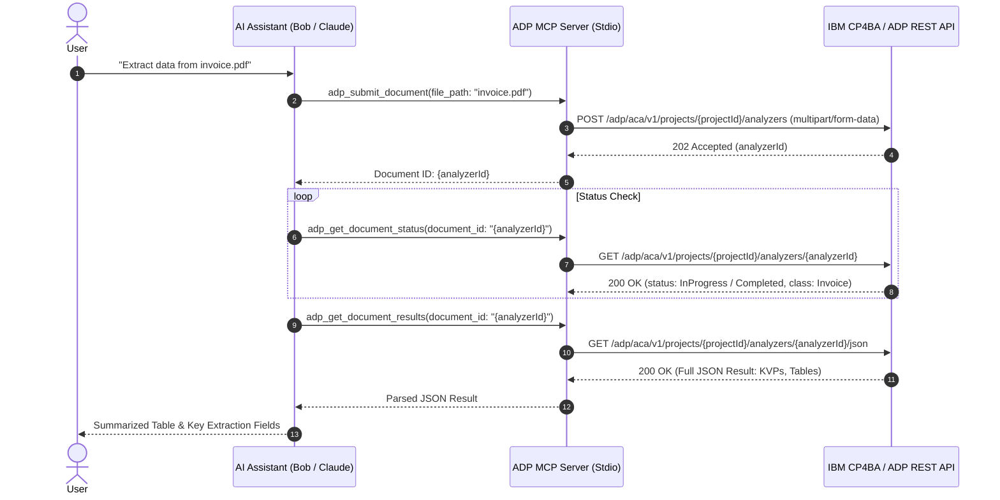

# IBM Automation Document Processing (ADP) MCP Server

A Model Context Protocol (MCP) server that connects AI assistants (such as Bob and Claude) directly to **IBM Cloud Pak for Business Automation (CP4BA) Automation Document Processing (ADP)**.

This server enables AI models to discover project ontologies, upload/submit documents for optical character recognition (OCR) and classification, monitor extraction status, and retrieve structured Key-Value Pairs (KVPs), tables, and annotated PDFs.

---

## Table of Contents

- [Features](#features)
- [Architecture & Protocol Flow](#architecture--protocol-flow)
- [Prerequisites](#prerequisites)
- [Authentication & Credentials](#authentication--credentials)
- [Installation & Build](#installation--build)
- [Configuration](#configuration)
  - [Bob MCP Configuration (`.bob/mcp.json`)](#bob-mcp-configuration-bobmcpjson)
  - [Claude Desktop Configuration (`claude_desktop_config.json`)](#claude-desktop-configuration-claude_desktop_configjson)
- [Available MCP Tools](#available-mcp-tools)
  - [`adp_get_ontology`](#adp_get_ontology)
  - [`adp_list_analyzers`](#adp_list_analyzers)
  - [`adp_submit_document`](#adp_submit_document)
  - [`adp_get_document_status`](#adp_get_document_status)
  - [`adp_get_document_results`](#adp_get_document_results)
  - [`adp_get_document_pdf`](#adp_get_document_pdf)
  - [`adp_list_documents`](#adp_list_documents)
  - [`adp_delete_document`](#adp_delete_document)
- [End-to-End Usage Examples](#end-to-end-usage-examples)
- [Troubleshooting & ADP Message Codes](#troubleshooting--adp-message-codes)

---

## Features

- **Project Schema Discovery**: Fetch full ontology definitions, document classes, key classes, and data types.
- **Document Submission**: Asynchronous processing for PDF, TIFF, PNG, and JPEG documents.
- **Status & Classification Polling**: Real-time progress monitoring and classification confidence tracking.
- **Structured Data Extraction**: Direct access to parsed Key-Value Pairs (KVPs), line items, tables, and OCR tokens.
- **Annotated Visual Outputs**: Download field-highlighted PDFs.
- **Resource Management**: Delete completed transactions to release cluster resources.

---

## Architecture & Protocol Flow



---

## Prerequisites

- **Node.js**: `v18.x` or higher (`v20+` recommended)
- **IBM Cloud Pak for Business Automation (CP4BA)** or **Cloud Pak for Data (CP4D)** instance with Automation Document Processing deployed.
- **Project ID**: The UUID of your configured Document Processing project.
- **CP4D / Zen User Credentials**: A valid username and API key with project access.

---

## Authentication & Credentials

ADP uses Cloud Pak for Data's **ZenApiKey** authentication scheme. The header must be formatted as:

```http
Authorization: ZenApiKey <BASE64_ENCODED_USER_AND_API_KEY>
```

### Generating the `ZenApiKey`

1. Log in to the Cloud Pak for Data / CP4BA web console.
2. Navigate to your profile (top right) $\rightarrow$ **Profile and settings** $\rightarrow$ **API key** $\rightarrow$ **Generate new key**.
3. Base64-encode your username and the generated API key:

```bash
echo -n "<your_cp4d_username>:<your_api_key>" | base64
```

> **Important**: Use your actual CP4D username (e.g., `cpadmin`, `cpmanager`, or email), **not** the literal word `apikey`.

---

## Installation & Build

Clone or navigate to the repository, install dependencies, and compile the TypeScript source:

```bash
cd adp-mcp-server
npm install
npm run build
```

This compiles the server into `adp-mcp-server/build/index.js` and sets executable permissions.

---

## Configuration

### Environment Variables

| Variable | Required | Description | Example |
| :--- | :---: | :--- | :--- |
| `ADP_BASE_URL` | **Yes** | Base URL of the CP4BA / CP4D instance | `https://cpd-cp4ba.apps.example.com` |
| `ADP_PROJECT_ID` | **Yes** | Target ADP Project UUID | `36e69b97-ee21-42e8-ae4b-915dbc92fe00` |
| `ADP_ZEN_API_KEY` | **Yes** | Full `ZenApiKey <token>` or base64 token | `ZenApiKey Y3BtYW5hZ2VyOkJLbm...` |

### Bob MCP Configuration (`.bob/mcp.json`)

```json
{
  "mcpServers": {
    "adp-mcp-server": {
      "command": "node",
      "args": [
        "/absolute/path/to/adp_mcp_server/adp-mcp-server/build/index.js"
      ],
      "env": {
        "ADP_BASE_URL": "https://cpd-cp4ba.apps.example.com",
        "ADP_PROJECT_ID": "36e69b97-ee21-42e8-ae4b-915dbc92fe00",
        "ADP_ZEN_API_KEY": "${env:ADP_ZEN_API_KEY}"
      },
      "alwaysAllow": [
        "adp_list_analyzers",
        "adp_list_documents",
        "adp_get_document_status",
        "adp_get_document_results",
        "adp_get_ontology"
      ]
    }
  }
}
```

### Claude Desktop Configuration (`claude_desktop_config.json`)

```json
{
  "mcpServers": {
    "adp": {
      "command": "node",
      "args": [
        "/absolute/path/to/adp_mcp_server/adp-mcp-server/build/index.js"
      ],
      "env": {
        "ADP_BASE_URL": "https://cpd-cp4ba.apps.example.com",
        "ADP_PROJECT_ID": "36e69b97-ee21-42e8-ae4b-915dbc92fe00",
        "ADP_ZEN_API_KEY": "ZenApiKey <BASE64_TOKEN>"
      }
    }
  }
}
```

---

## Available MCP Tools

### `adp_get_ontology`
Retrieves the full project ontology schema: document classes, aliases, key classes, fields, and confidence thresholds.

- **Parameters**: *None*
- **REST Endpoint**: `GET /adp/aca/v1/projects/{projectId}/ontology`

---

### `adp_list_analyzers`
Lists all active document analyzers configured in the project.

- **Parameters**: *None*
- **REST Endpoint**: `GET /adp/aca/v1/projects/{projectId}/analyzers`

---

### `adp_submit_document`
Uploads a local file and submits it for OCR, classification, and extraction.

- **Parameters**:
  - `file_path` (*string*, **required**): Absolute path to the document file (`.pdf`, `.png`, `.jpg`, `.jpeg`, `.tif`, `.tiff`).
  - `analyzer_id` (*string*, *optional*): Custom analyzer ID. Uses project default if omitted.
- **REST Endpoint**: `POST /adp/aca/v1/projects/{projectId}/analyzers`
- **Returns**: Document record ID (`analyzerId`) for status polling.

---

### `adp_get_document_status`
Retrieves the execution status and classification results of a submitted document.

- **Parameters**:
  - `document_id` (*string*, **required**): Document transaction ID returned by `adp_submit_document`.
- **REST Endpoint**: `GET /adp/aca/v1/projects/{projectId}/analyzers/{document_id}`
- **Key Response Fields**:
  - `statusDetails[0].status`: `InProgress`, `Completed`, or `Failed`
  - `statusDetails[0].progress`: Completion percentage (`0`–`100`)
  - `classification.DocumentClass.Actual`: Matched document class (e.g., `Payslip`, `Invoice`)
  - `classification.DocumentClass.ClassConfidence`: Classification score
  - `classification.DocumentClass.ValidationResult`: `Pass` or `Fail`

---

### `adp_get_document_results`
Retrieves full extracted structured JSON data once processing has status `Completed`.

- **Parameters**:
  - `document_id` (*string*, **required**): Document transaction ID.
- **REST Endpoint**: `GET /adp/aca/v1/projects/{projectId}/analyzers/{document_id}/json`
- **Output Content**:
  - `KVPTable`: Key-value pairs with bounding boxes, mapped key classes, confidence scores, and validation results.
  - `TableList`: Extracted multi-row tables and line items.
  - `BarcodeList`: Detected barcode types and decoded values.

---

### `adp_get_document_pdf`
Downloads the OCR-annotated PDF highlighting all identified fields with color-coded bounding boxes.

- **Parameters**:
  - `document_id` (*string*, **required**): Document transaction ID.
  - `output_path` (*string*, **required**): Absolute local path to save the PDF.
- **REST Endpoint**: `GET /adp/aca/v1/projects/{projectId}/analyzers/{document_id}/pdf`

---

### `adp_list_documents`
Lists submitted document transactions and their current status.

- **Parameters**:
  - `limit` (*number*, *optional*, default `20`): Maximum records to retrieve.
  - `offset` (*number*, *optional*, default `0`): Pagination offset.
- **REST Endpoint**: `GET /adp/aca/v1/projects/{projectId}/analyzers`

---

### `adp_delete_document`
Deletes a document transaction record and releases backend storage/processing resources.

- **Parameters**:
  - `document_id` (*string*, **required**): Document transaction ID to delete.
- **REST Endpoint**: `DELETE /adp/aca/v1/projects/{projectId}/analyzers/{document_id}`

---

## End-to-End Usage Examples

### 1. Ingest & Extract Data from a Document

In your chat with Bob or Claude:

```text
User: "Submit the file Payslip Samples EN/TS_PAY_01_0005.pdf to ADP for extraction"

AI: (Invokes adp_submit_document)
    -> Document ID: 83562b12-0f91-49a9-9b8c-a6c392beaede

AI: (Polls adp_get_document_status)
    -> Status: Completed (100%) | Class: Payslip (75.4% confidence)

AI: (Invokes adp_get_document_results)
    -> Extracted:
       - Employer Name: SMITH AND COMPANY, INC.
       - Employee Name: Johnson, Robert
       - Employee ID: XXX-XX-6789
       - Pay Date: 1/7/21 to 1/13/21
       - Net Earnings: 1560.71
```

### 2. Download Annotated PDF Output

```text
User: "Download the annotated PDF for document 83562b12-0f91-49a9-9b8c-a6c392beaede to ./output/annotated.pdf"

AI: (Invokes adp_get_document_pdf)
    -> Annotated PDF saved to: /path/to/output/annotated.pdf (185,240 bytes)
```

---

## Troubleshooting & ADP Message Codes

| Status / Code | Meaning | Resolution |
| :--- | :--- | :--- |
| `401 Unauthorized` | Invalid or expired `ZenApiKey`. | Check that the base64 token is encoded as `username:api_key` using your CP4D login username. |
| `404 Not Found` (nginx) | Invalid endpoint routing or missing `ZenApiKey ` header prefix. | Ensure the URL includes `/adp/aca/v1/projects/{projectId}/...` and the header starts with `ZenApiKey `. |
| `CIWCA11106` | Document submission accepted. | Normal response (HTTP 202); begin polling `adp_get_document_status`. |
| `CIWCA11107` | Status/analyzer retrieved successfully. | Document status returned (HTTP 200). |
| `CIWCA11108` | Document deleted. | Transaction and artifacts cleaned up successfully. |
| `CIWCA16004` | `jsonOptions` parameter missing or invalid format. | Provide comma-delimited options (`HR,DC,KVP,TH,OCR,SN,MT,CB,ST,DS,CHAR`). |
| `CIWCA16030` | Document / Analyzer ID not found. | Verify the `document_id` UUID or check if the document has been deleted. |
| `CIWCA16036` | File extension or format unsupported. | Use supported file formats (`.pdf`, `.png`, `.jpg`, `.jpeg`, `.tif`, `.tiff`). |
| `CIWCA20001` | Low OCR quality or unreadable page. | Inspect the scan quality, DPI resolution, or page orientation of the source file. |

---

## License

Internal / Apache-2.0. Compatible with IBM Cloud Pak for Business Automation.
